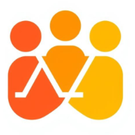
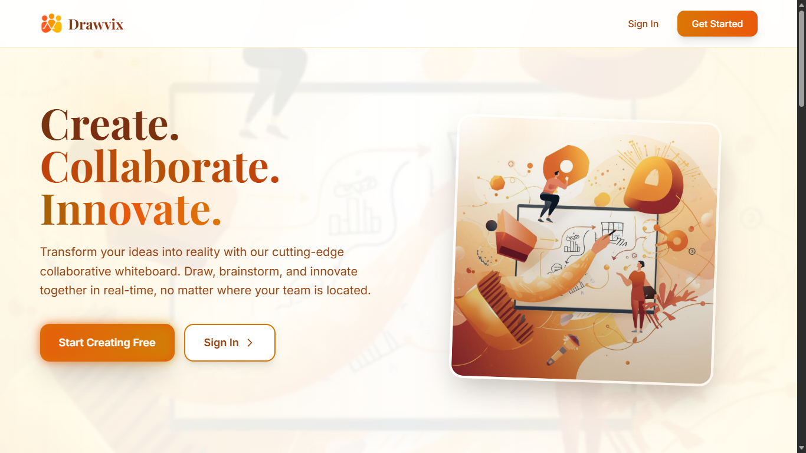

<div align="center">
  
  <h1>Collaborative Whiteboard</h1>
</div>

A Web Application That Allows Multiple Users To Draw, Write, And Collaborate On A Virtual Whiteboard In Real-time. Users Can See Updates Instantly, Communicate Via Chat, And Work Together Seamlessly.

## Screenshots




## Key Features

- **Real-time Collaboration**: Multiple users can draw on the same whiteboard simultaneously.
- **Live Chat**: Integrated chat feature for seamless communication while collaborating.
- **User Authentication**: Secure login and registration system.
- **Board Management**: Create, join, and manage multiple whiteboards.
- **Tools**: Various drawing tools including pen, shapes, and text.

## Tech Stack

- **Frontend**: React.js, Vite, Tailwind CSS
- **Backend**: Node.js, Express.js
- **Real-time Engine**: Socket.io
- **Database**: MongoDB

## Installation & Setup

### Prerequisites

- Node.js installed
- MongoDB installed and running

### Backend Setup

1. Navigate to the backend directory:
   ```bash
   cd backend
   ```
2. Install dependencies:
   ```bash
   npm install
   ```
3. Create a `.env` file in the backend directory and configure your environment variables (PORT, MONGODB_URI, JWT_SECRET).
4. Start the server:
   ```bash
   npm start
   ```

### Frontend Setup

1. Navigate to the frontend directory:
   ```bash
   cd frontend
   ```
2. Install dependencies:
   ```bash
   npm install
   ```
3. Start the development server:
   ```bash
   npm run dev
   ```

## Usage

1. Open your browser and navigate to the frontend URL (usually `http://localhost:5173`).
2. Register for a new account or login.
3. Create a new board or join an existing one.
4. Start collaborating!
